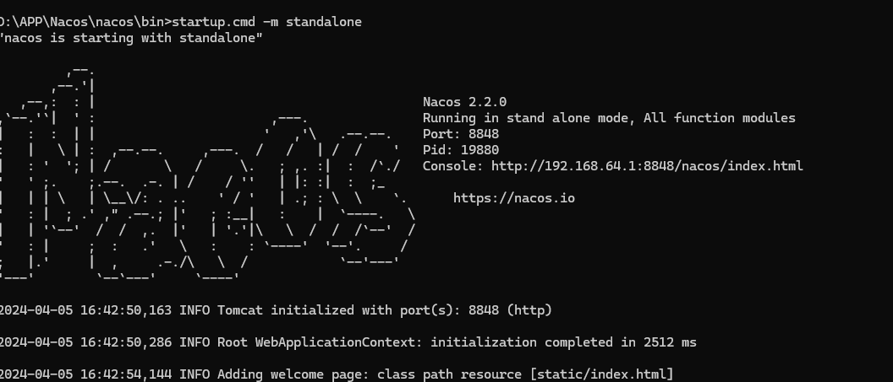
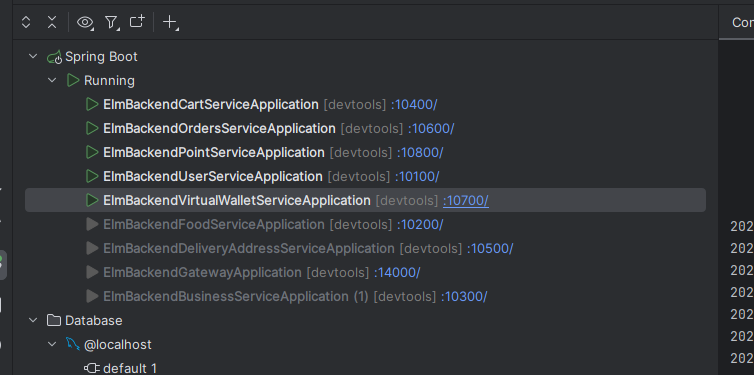
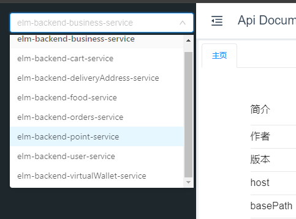

# Elm项目 微服务修改
### 1. 模块划分
#### 1.1. 公共模块
common 公共服务（elm-backend-common）：全局异常处理器、请求响应封装类、公用的工具类
model 模型模块（elm-backend-model）：服务公用的实体类
公用接口（elm-backend-service-client）：各个服务的接口，只存放接口不存放实现类（多个服务之间要共享）

#### 1.2. 业务功能
用户服务（elm-backend-user-service）10100
商品服务（elm-backend-food-service）10200
商家服务（elm-backend-business-service）10300
购物车服务（elm-backend-cart-service）10400
送货地址服务（elm-backend-deliveryAddress-service）10500
订单服务（elm-backend-orders-service）10600
虚拟钱包服务（elm-backend-virtualWallet-service）10700
积分服务（elm-backend-point-service）10800

#### 1.3. 依赖服务
选择使用Nacos，作为服务发现与注册中心，使服务发现和调用彼此
微服务网关（elm-backend-gateway）14000，聚合所有的接口，统一接收处理前端的请求

### 2. 路由划分
用Springboot的context-path 统一修改各项目的接口前缀
如用户服务：
- /api/user
- /api/user/inner （服务内部的调用，网关层面做限制）

### 3. 修改流程
Nacos注册中心使用2.2.0版本 和 Spring-Cloud的2021.0.5.0版本一直
在nacos的bin目录中 执行startup.cmd -m standalone，启动nacos

### 4. 修改完毕代码后，执行如下：

### 5. 使用swagger2验证端口执行情况
